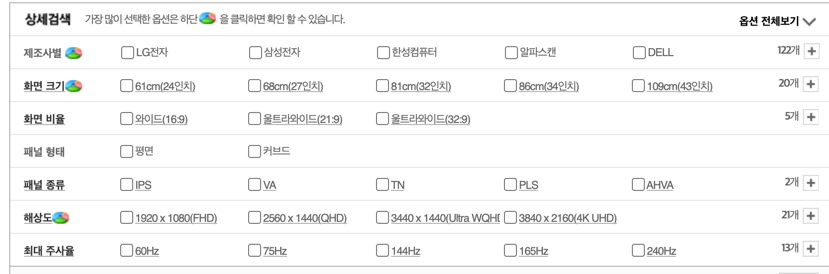

# Command Pattern

- 커맨드 패턴(Command pattern)이란 요청을 객체의 형태로 캡슐화하여 사용자가 보낸 요청을 나중에 이용할 수 있도록 매서드 이름, 매개변수 등 요청에 필요한 정보를 저장 또는 로깅, 취소할 수 있게 하는
  패턴이다.


```java

public class RemoteControl {
    private Runnable button;

    public RemoteControl() {
    }

    public void setCommand(Runnable command) {
        button = command;
    }

    public void pressButton() {
        button.execute();
    }
}

class ConsoleIO implements IO {
    @Override
    public void show(String str) {
        System.out.println(str);
    }
}

class Main {
    public static void main(String[] args) {
        RemoteControl remote = new RemoteControl();
        IO io = new ConsoleIO();

        Light light = new Light(io);
        Stereo stereo = new Stereo(io);

        remote.setCommand(new LightOnCommand(light));
        remote.pressButton();
        remote.setCommand(new StereoOnWithCDCommand(stereo));
        remote.pressButton();
        remote.setCommand(new StereoOffCommand(stereo));
        remote.pressButton();
    }
}
```

# 사용처



```java
public class Main {
    public static void main(String[] args) {
        Thread t = new Thread(new Command());
        t.start();
    }
}

class Command implements Runnable {
    @Override
    public void run() {
        System.out.println("RUN!");
    }
}
```