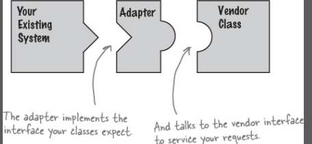
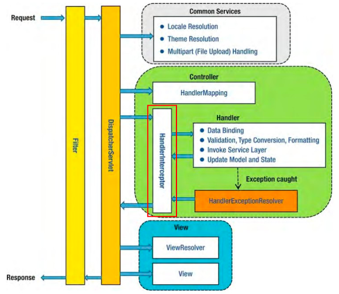
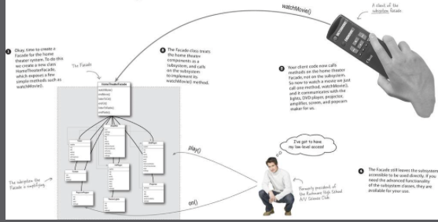

# adaptor





- preHandle
- postHandle
- afterComplete
- afterConcurrentHandlingStarted

# facade



- 어떤 서브시스템의 일련의 인터페이스에 대한 통합된 인터페이스를 제공합니다. 퍼사드에서 고수준 인테페이스를 정의하기 때문에 서브시스템을 더 쉽게 사용할 수 있습니다.

# 최소 지식 원칙

- 디미터의 법칙
- 객체 사이에는 최소한의 지식만 알고 있어야 합니다.
    - 객체의 변경이 다른 객체에게 영향을 최소화해야 합니다.
    - 객체 간의 관계가 적으면 코드를 이해하기가 쉽게 안정적입니다.
- 어떻게 하면 결합도를 낮출수 있을까?
    - 아래 경우에만 해당 메소드를 호출
        - 객체 자체
        - 메소드에 매개변수로 전달된 객체
        - 그 메소드에서 생성하거나 인스턴스를 만든 객체
        - 그 객체에 속하는 구성요소

```java
// X
public float getTemp(){
        Thermometer thermometer=station.getThermometer();
        return thermemeter.getTemperature();
        }
```

```java
// O
public float getTemp(){
        return station.getTemperature();
        }
```