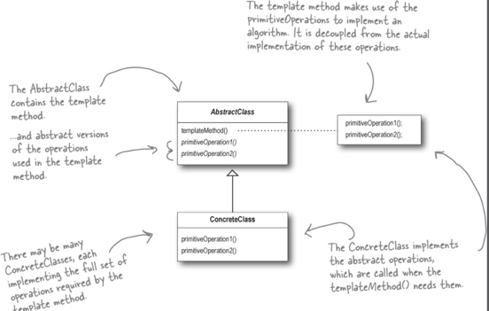

# Template Method Pattern

- 특정 메소드에서 알고리즘의 골격을 정의하고 각 구현체에서 구성요소를 재정의 하는 방식으로

# Template Method VS Strategy

- 템플릿 메소드
    - 런타임에 타입 선택
    - 추상 메소드 사용
    - 클래스 갯수가 증가
- 전략 패턴
    - 런타임에 합성
    - 중간 인터페이스로 분산

- ex. 2개의 FlyBehavior + 3개의 QuackBehavior
    - 템플릿 메소드
        - 6개의 클래스가 필요
    - 전략 패턴
        - FlyBehavior,QuackBehavior를 인자로 받아능 조합으로 사용가능 